# SDL game prototype

### About
- Explore an open world consisting of 48 unique rooms.
- Use your skills and items to interact with the environment.
- Push, pull, throw, melt and manipulate various object to gain access to other rooms and resources.
- Fight enemies ina turned based combat with telegraphed attacks.
- Lure enemies into traps and take advantage of their attacks to access hard to reach goods.
- Watch out for environmental hazards.
- Open blocked passages with skills or items.
- Exchange gemstones for other items in vending machines (or break them to gain items without paying).
- Bring to life other allies to help with room puzzles.
- Add new augmentations to your body to unlock new skills and skill synergies.
- Decide between mutually exclusive augmentations and choose your way of approaching the world (jumping or floating on water, pushing or throwing objects, pulling  or putting items into far away objects, manipulating mechanical objects or teleporting freely in room).

### How to run (Linux)
- (project uses **make**, **gcc** and dynamically links to **SDL2**)
- install SDL 2.0 (https://wiki.libsdl.org/SDL2/Installation)
- clone repository
- run ``` make && ./sdl_game ```

### Inspired by
- Into the Breach : telegraphed attack to take advantage of enemy actions and 8x8 grid rooms
- metroidvanias : approach to level exploration (certain level chunks inaccessible without appropriate skill, new skills gained from objects spread throughout the level)
- immersive sims : interacting with the environment in systemic ways (meltable objects can be melted with cell item by the player or with lasers by enemy turrets, water and lava tiles accessible to floating enemies or hero with floating ability, pits can be crossed by jumping, being thrown by enemy, pulling yourself to another object with chain or by flying with flying ability)

### To do
- make it run on Windows
- add HUD (right now all the info is being printed on console)

### Recordings

<p float="center">
  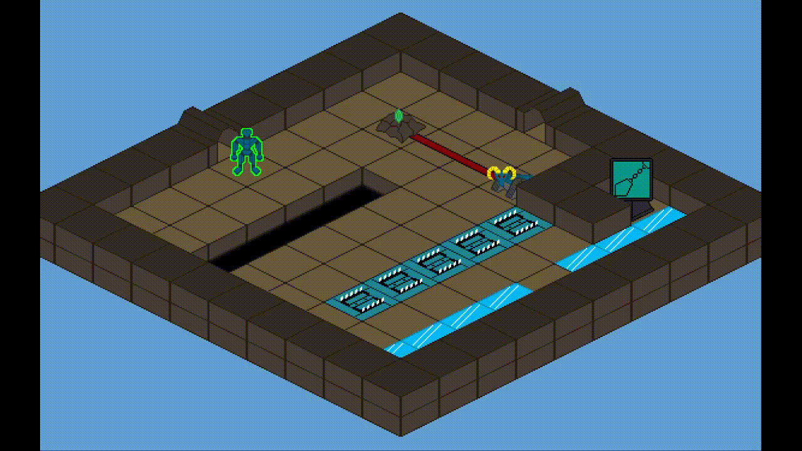
  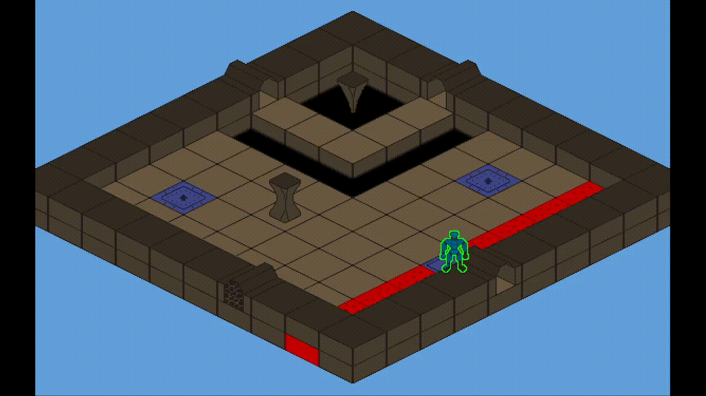 
  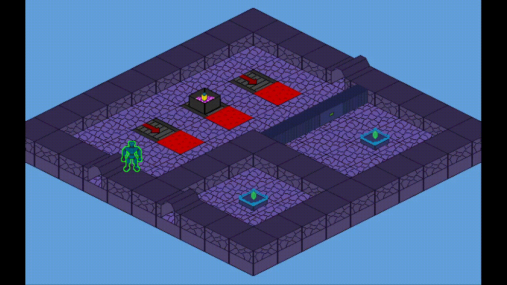
  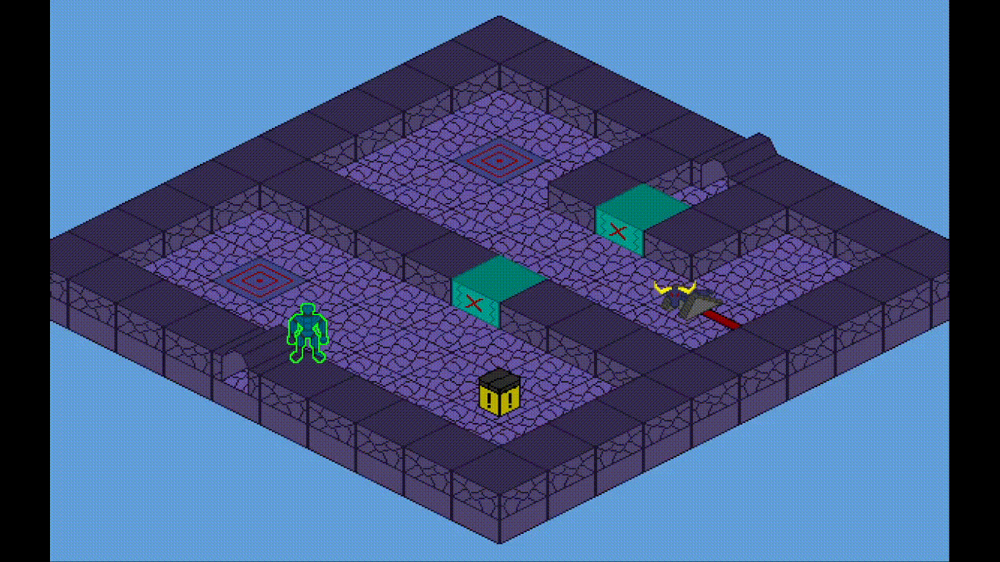
  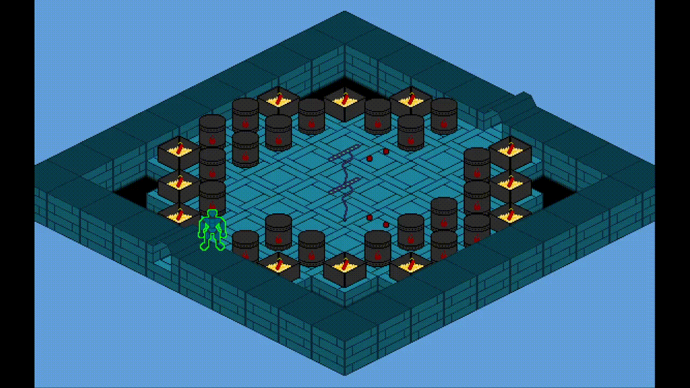
  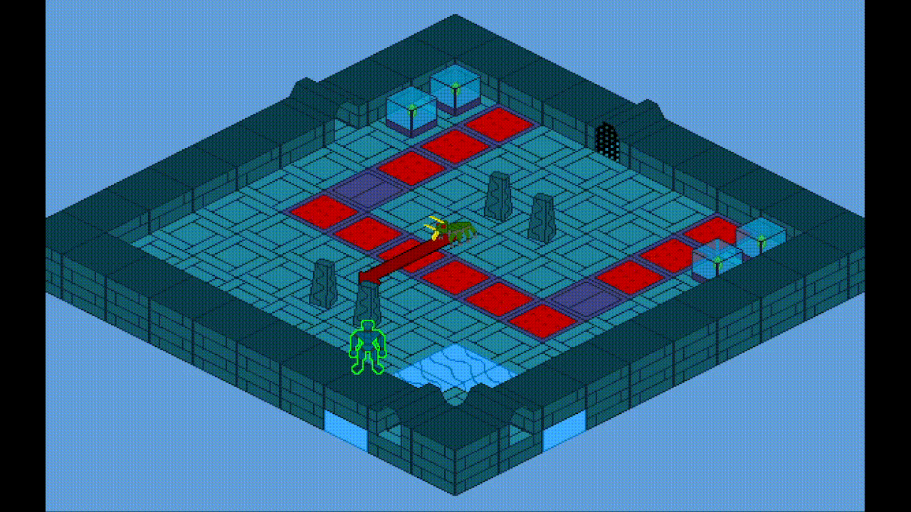
  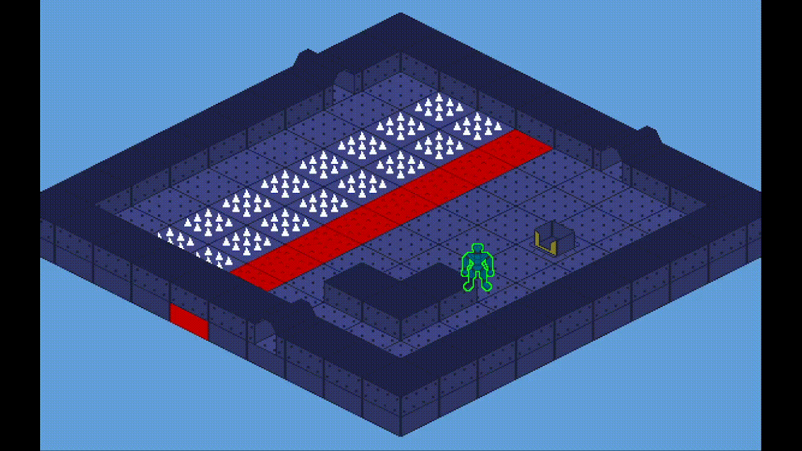
  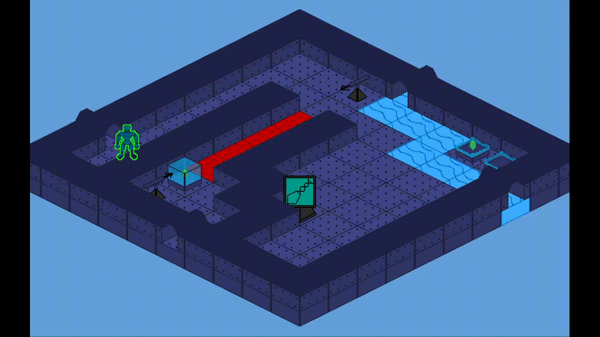
  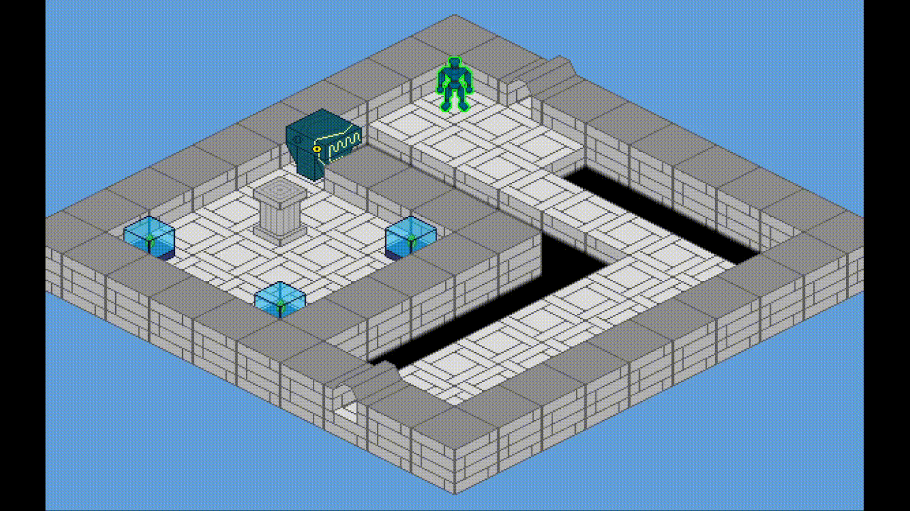
  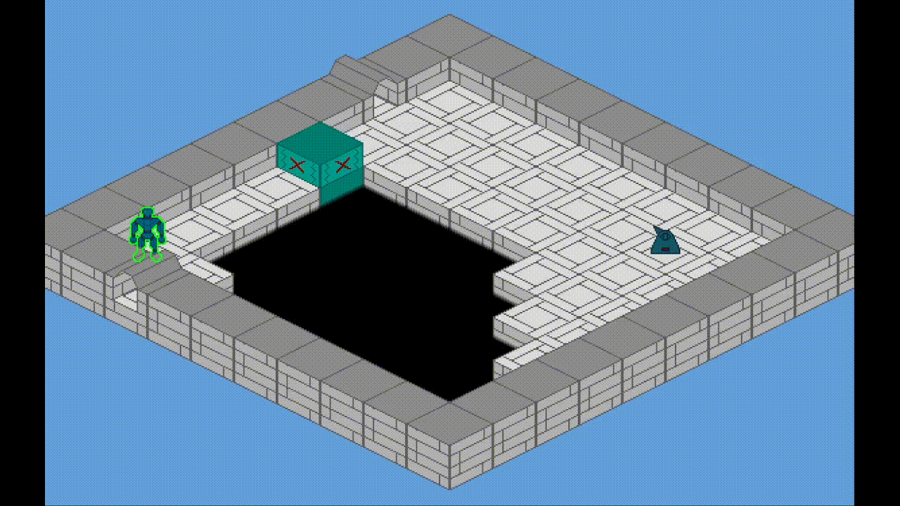
  
  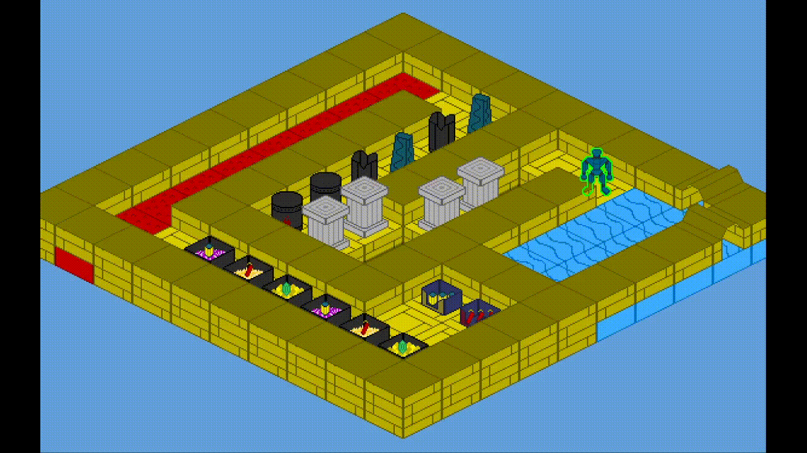
</p>
