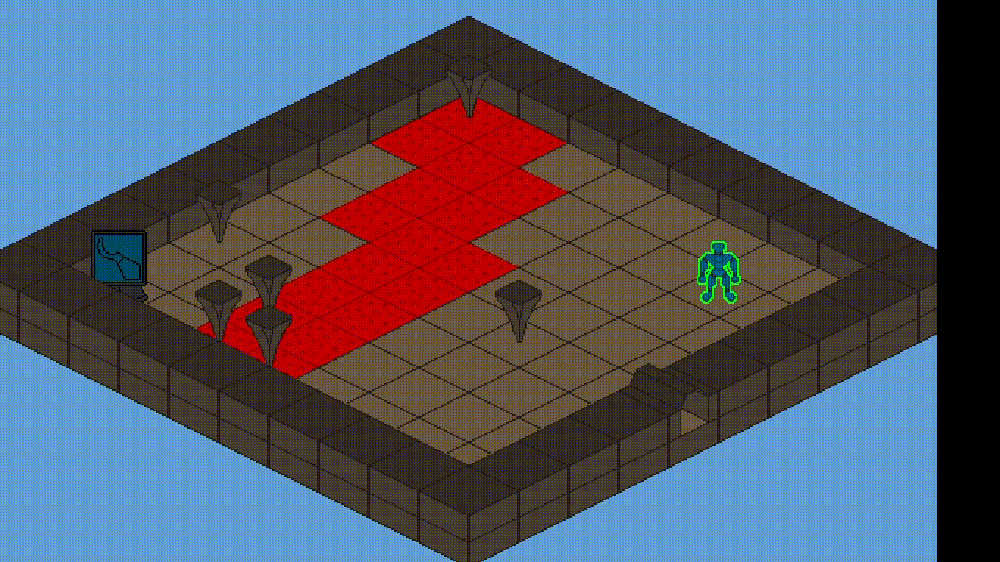
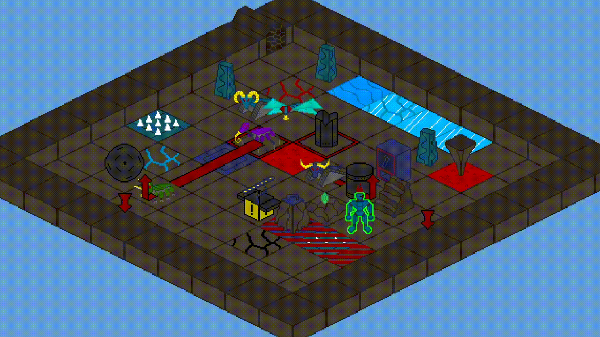
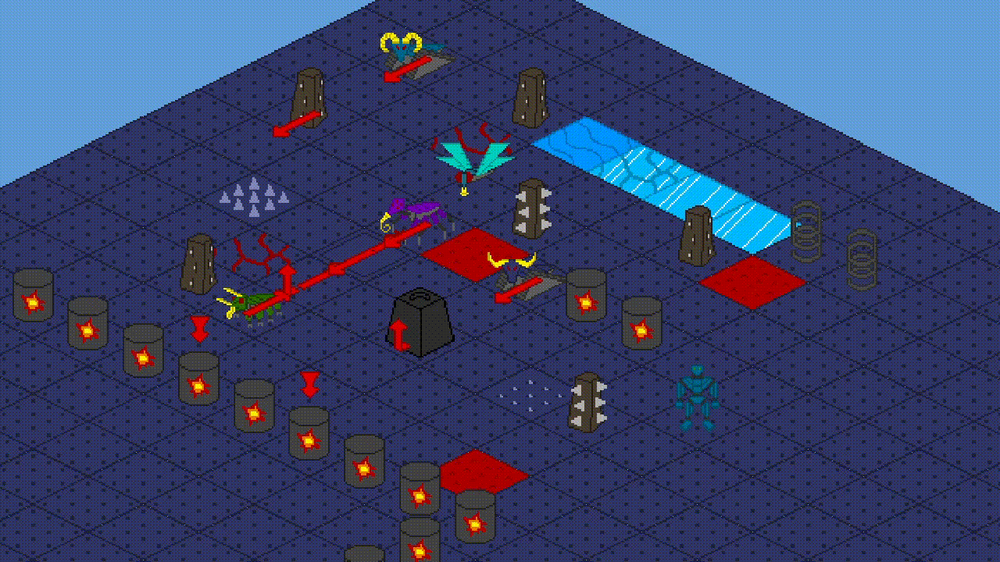
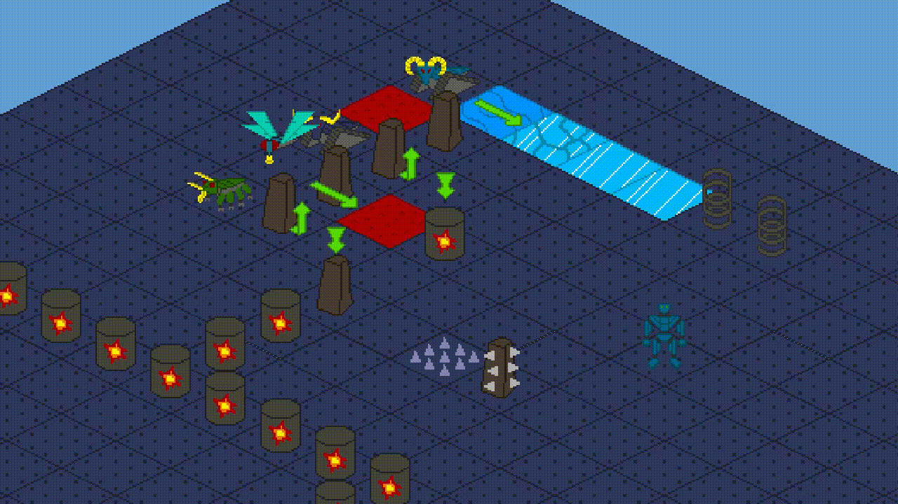

# Fallen Stalactite

https://marcin12345.itch.io/fallen-stalactite

### About
- Explore an open dungeon with 48 unique rooms.
- Use your skills and items to interact with the environment.
- Push, pull, throw, melt and manipulate objects to gain access to other rooms and resources.
- Fight enemies in a turned based combat with telegraphed attacks.
- Lure enemies into traps and take advantage of their attacks.
- Watch out for environmental hazards.
- Bring to life other allies to help with room puzzles.
- Add augmentations to your hero to unlock new skills and skill synergies.

### How to run
- you will need to install SDL2, SDL2_image, SDL2_mixer and SDL2_ttf (from a package manager or from source)
- SDL:        https://github.com/libsdl-org/SDL/releases
- SDL_image:  https://github.com/libsdl-org/SDL_image/releases
- SDL_mixer:  https://github.com/libsdl-org/SDL_mixer/releases
- SDL_ttf:    https://github.com/libsdl-org/SDL_ttf/releases
- general installation guide: https://wiki.libsdl.org/SDL2/Installation
##### Linux
- tutorial video: https://www.youtube.com/watch?v=P3_xhDIP7bc&list=PLvv0ScY6vfd-p1gSnbQhY7vMe2rng0IL0&index=2
- run: `gcc ./src/*.c  -lm -lSDL2 -lSDL2_image -lSDL2_mixer -lSDL2_ttf -o sdl_game && ./sdl_game`
- there is also Makefile available: `make && ./sdl_game`
##### Windows
- download MinGW: https://sourceforge.net/projects/mingw-w64
- (what to actually download: https://www.youtube.com/watch?v=1TPmiiAqmlc)
- tutorial video: https://www.youtube.com/watch?v=DQ-NBjBFLJ4&list=PLvv0ScY6vfd-p1gSnbQhY7vMe2rng0IL0&index=3
- download mingw; add mingw\bin to your PATH env variable; download devel mingw version of SDL2, SDL2_image, SDL2_mixer and SDL2_ttf; extract their bin, include, lib and share files into the mingw folder
- run: `gcc ./src/*.c -o sdl_game.exe -IC:/mingw64/include -lmingw32 -lSDL2main -lSDL2 -lSDL2_image -lSDL2_mixer -lSDL2_ttf && sdl_game.exe`
##### Web
- install and activate emsdk: https://emscripten.org/docs/getting_started/downloads.html
- run: `emcc -sWASM=1 -sUSE_SDL_IMAGE=2 -sSDL2_IMAGE_FORMATS='["png"]' -sUSE_SDL_MIXER=2 -sSDL2_MIXER_FORMATS='["mp3"]' -sUSE_SDL_TTF=2 -o index.html --shell-file template.html ./src/*.c --preload-file ./res --use-preload-plugins -sALLOW_MEMORY_GROWTH=1 -sMAXIMUM_MEMORY=1gb -O0 && emrun --browser firefox index.html` (change 'firefox' to your specific browser)
- zip files: index.html, index.js, index.wasm, index.data and template.html into sdl_game.zip and then upload zip to itch.io (note for me so i don't forget)

### History

  <h5>23.04.2024</h5>
  
  <h5>21.03.2024</h5>
  
  <!-- <h5>28.02.2024</h5> -->
  <!--  -->
  <h5>11.02.2024</h5>
  
  <h5>26.01.2024</h5>
  
  <!-- <h5>09.01.2024</h5> -->
  <!--  -->
  <h5>09.11.2023</h5>
  
  <h5>19.10.2023</h5>
   

